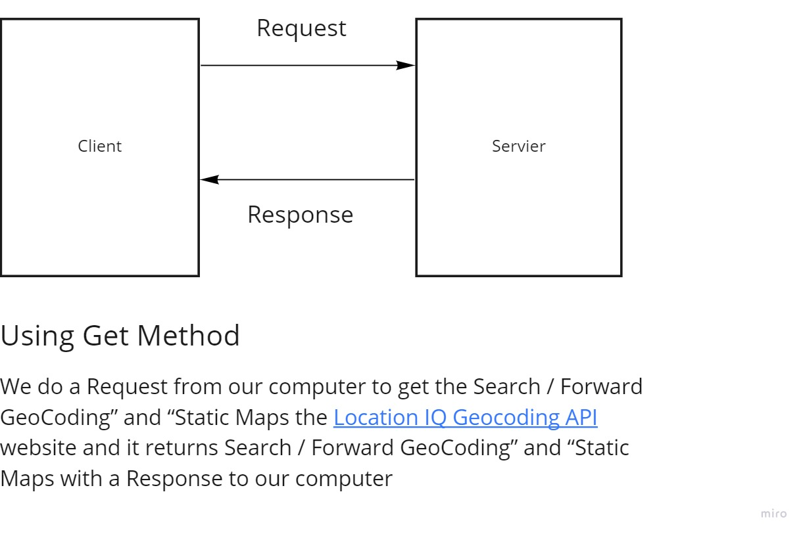

# City Explorer

### ***[Netlify Live URL ......](https://cityexplorers.netlify.app/)***

---
* **Author :** Mohammad Alwrekat

* **Version :** 1.0.0 .

* **Getting Started :** open the website enter a city name press on explore .

* **Architecture :** 
  * react js 
  * bootstrap 
  * locationiq.com APIs

* **Overview :** ***[WorkFlow Link .........](https://miro.com/app/board/o9J_lx-WrTA=/)***

* **Credit and Collaborations :** 
    * [Wasem Idrees](https://github.com/WasemIdres) 
    * [locationiq](locationiq.com)
    * [google](google.com)
    * [bootstrap](bootstrap.com)

* **Change Log :** first launch 2:00 pm .

---
## ***Request-Response Cycle***

#### **Draw And Document The Data Flow**

---
## Time Estimate For Features :

Name of feature: **1** Set up your React repository & API keys .

Estimate of time needed to complete: 30 Min .

Start time : 2:20 pm .

Finish time: 3:10 pm . 

Actual time needed to complete: 50 Min .

---
Name of feature: **2** Locations .

Estimate of time needed to complete: 2 Hours .

Start time : 3:40 pm .

Finish time: 6:00 pm . 

Actual time needed to complete: 2:20 Min .

---
Name of feature: **3** map .

Estimate of time needed to complete: 2 Hour .

Start time : 7:20 pm .

Finish time: 10:00 pm . 

Actual time needed to complete: 2:40 Hour .

---
Name of feature: **4** Errors .

Estimate of time needed to complete: 1 Hour .

Start time : 10:20 pm .

Finish time: 11:20 pm . 

Actual time needed to complete: 1 Hour .

---
Name of feature: **5** Movie .

Estimate of time needed to complete: 5 Hour .

Start time : 4:20 pm .

Finish time: 9:20 pm . 

Actual time needed to complete: 5 Hour .

---